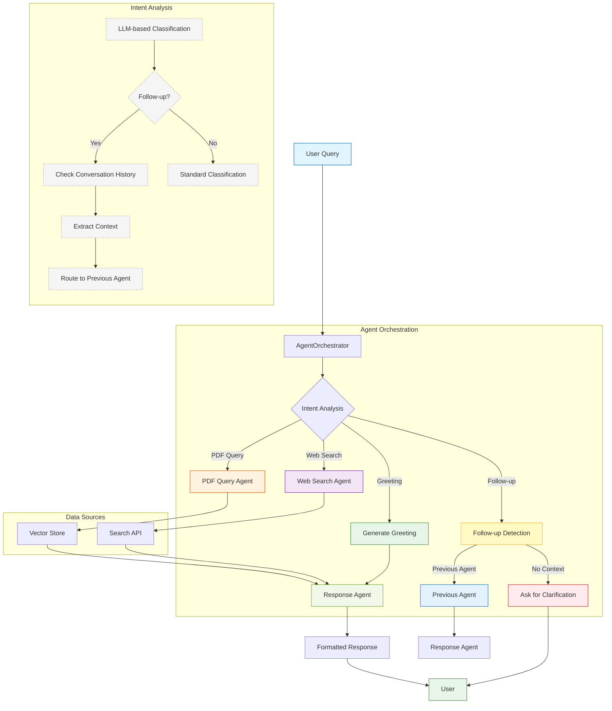

# Agent Orchestration Flow

This document outlines the high-level flow of agent orchestration in the Chat with PDF application, describing how different agents interact and coordinate to process user queries.

## Overview

The Agent Orchestrator serves as the central nervous system of the application, managing the flow of information between specialized agents. It follows a structured workflow to ensure efficient processing of user queries while maintaining conversation context.

## Core Components

### 1. AgentOrchestrator
- **Primary Coordinator**: Manages the entire agent ecosystem
- **State Manager**: Maintains conversation state and context
- **Decision Engine**: Determines the appropriate agent(s) for each query
- **Error Handler**: Implements fallback mechanisms and error recovery

### 2. Agent Types
- **PDF Query Agent**: Handles document-related queries
- **Web Search Agent**: Manages external information retrieval
- **Response Agent**: Formats and delivers final responses

## Orchestration Flow

### 1. Message Reception
- Receives user input through the API layer
- Validates and preprocesses the input
- Updates conversation history
- Initializes or retrieves conversation state

### 2. Intent Analysis
- Analyzes the user's message to determine intent
- Considers conversation history for context
- Classifies the query into predefined categories
- Identifies entities and key information

### 3. Agent Selection & Routing
- Based on intent classification, selects the appropriate agent(s)
- Routes simple queries directly to the relevant agent
- For complex queries, may engage multiple agents in sequence
- Handles special cases like follow-up questions

### 4. Parallel Processing (When Applicable)
- For queries requiring multiple data sources, initiates parallel processing
- Coordinates between different agents
- Aggregates results from multiple sources
- Manages timeouts and partial failures

### 5. Context Management
- Maintains conversation context across turns
- Tracks entities, topics, and user preferences
- Handles coreference resolution (e.g., pronouns)
- Manages conversation state transitions

### 6. Response Generation
- Collects and processes results from agents
- Applies response formatting and templating
- Ensures consistent output format
- Adds relevant metadata and source attribution

### 7. Error Handling & Fallbacks
- Detects and handles agent failures
- Provides meaningful error messages
- Falls back to alternative strategies when primary methods fail

## Special Flows

### Follow-up Questions
1. **Detection**: Uses LLM-based analysis to identify follow-up questions by examining conversation history
2. **Context Analysis**: Extracts relevant context from previous interactions
3. **Routing**: Routes to the same agent that handled the original query
4. **Ambiguity Handling**: Skips ambiguity checks for follow-up questions to maintain context
5. **Response Generation**: Maintains conversation flow by referencing previous context in responses

### Multi-Agent Collaboration
1. Identifies queries requiring multiple agents
2. Coordinates parallel execution

*This document provides a high-level overview of the agent orchestration flow. For implementation details, please refer to the source code and related documentation.*
