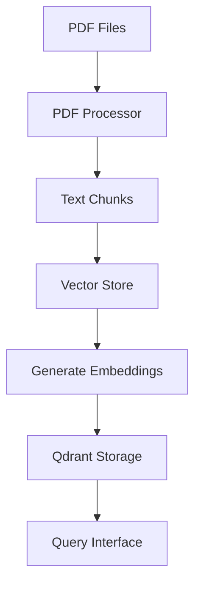

# PDF Ingestion and Text Generation

This document explains the process of ingesting PDF documents, extracting text, generating embeddings, and storing them for semantic search in the Chat with PDF application.

## Overview

The PDF ingestion pipeline consists of three main components:

1. **PDF Processing**: Extracts and chunks text from PDF files
2. **Embedding Generation**: Converts text chunks into vector embeddings
3. **Vector Storage**: Stores and indexes the embeddings for efficient similarity search

## Components

### 1. PDF Processor (`scripts/pdf_processor.py`)

Responsible for extracting and preparing text content from PDF files.

#### Key Features:
- **Text Extraction**: Extracts text from PDF files while preserving page numbers
- **Text Cleaning**: Normalizes whitespace and removes unnecessary characters
- **Chunking**: Splits text into manageable chunks with configurable size and overlap
- **Page Tracking**: Maintains page number references for source attribution

#### Chunking Strategy:
- Splits text at sentence boundaries
- Ensures chunks don't exceed the specified token limit
- Maintains context with overlapping chunks
- Preserves document structure and formatting

### 2. Vector Store (`app/core/vector_store.py`)

Manages the storage and retrieval of document embeddings.

#### Key Features:
- **Embedding Generation**: Uses SentenceTransformers to generate dense vector representations
- **Vector Storage**: Leverages Qdrant for efficient vector similarity search
- **Collection Management**: Handles creation and configuration of vector collections
- **Batch Processing**: Efficiently processes documents in batches

#### Embedding Process:
1. Text chunks are passed through a pre-trained language model
2. Generates fixed-size vector representations (embeddings)
3. Normalizes embeddings for cosine similarity calculations
4. Stores vectors with associated metadata for retrieval

### 3. Ingestion Script (`scripts/ingest_pdfs.py`)

Orchestrates the end-to-end PDF ingestion process.

#### Ingestion Workflow:
1. **Input Validation**:
   - Verifies input directory exists
   - Validates PDF files
   - Checks for previously processed documents

2. **Document Processing**:
   - Tracks progress and handles errors
   - Maintains status of processed files

3. **Storage**:
   - Batches chunks for efficient storage
   - Updates vector store with new documents
   - Maintains document metadata and relationships

## Data Flow



## Configuration

Key configuration parameters (from `app/config/config.py`):

```ini
# PDF Processing
CHUNK_SIZE=1000        # Target size of text chunks (in characters)
CHUNK_OVERLAP=200      # Overlap between chunks (in characters)

# Vector Storage
QDRANT_URL="http://localhost:6333"
QDRANT_COLLECTION="documents"
EMBEDDING_MODEL="all-MiniLM-L6-v2"  # Pre-trained model for embeddings

# Ingestion
BATCH_SIZE=32          # Number of chunks to process in a batch
MAX_RETRIES=3          # Number of retry attempts for failed operations
```

## Best Practices

1. **Document Preparation**:
   - Ensure PDFs are searchable (OCR if needed)
   - Remove sensitive information before ingestion
   - Use consistent naming conventions

2. **Performance Tuning**:
   - Adjust chunk size based on document complexity
   - Monitor memory usage with large documents
   - Consider batch size based on available system resources

3. **Error Handling**:
   - Check logs for failed processing
   - Use the `--force` flag to retry failed documents
   - Monitor storage usage with large document collections

## Monitoring

Logs are stored in `logs/ingestion.log` and include:
- Processing start/end times
- Number of documents processed
- Any errors or warnings
- Performance metrics

---

*For implementation details, refer to the source code and inline documentation in the respective files.*
