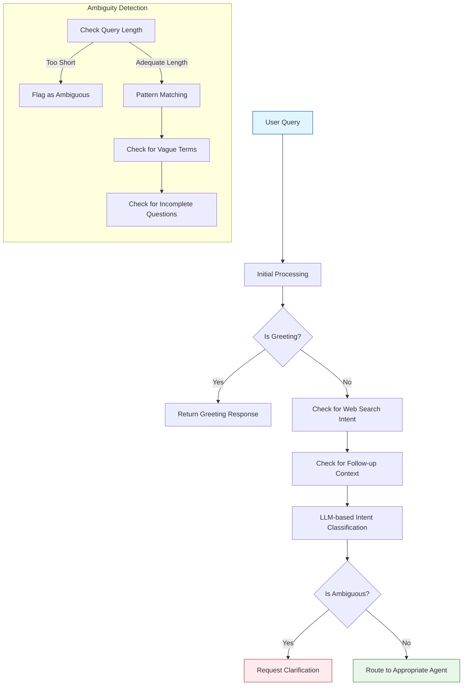

# Intent Clarification Process

## Overview
The intent clarification process is a crucial part of the Agent Orchestrator that ensures user queries are properly understood before routing them to the appropriate agent. This documentation explains how the system detects ambiguous queries and requests clarification when needed.

## Architecture



## Key Components

### 1. Ambiguity Detection


#### Pattern Matching
- **Short/Incomplete Queries**: Queries with 3 or fewer words (excluding common greetings)
- **Vague Quantity Terms**: Phrases like "how many", "how much", "what is the number of"
- **Vague Quality Terms**: Words like "good", "bad", "better", "worse" without clear context
- **Incomplete Questions**: Questions that don't specify what information is being requested


### 2. Clarification Process

When ambiguity is detected:

1. **Flag the Query**: Mark the query as needing clarification
2. **Generate Clarification Message**: Create a user-friendly message explaining what's unclear
3. **Provide Examples**: Include examples of clearer phrasings
4. **Update State**: Set appropriate flags in the conversation state

### 3. Follow-up Handling

Special handling for follow-up questions:
- Use LLM to analyze the query and determine if it is a follow-up question and analyze previous conversation history
- Skips ambiguity checks for follow-up questions
- Maintains context from previous interactions
- Routes to the same agent that handled the original query

## State Management

The orchestrator maintains the following state for intent clarification:

```python
{
    "intent": "clarification_needed",
    "metadata": {
        "intent_classification": {
            "detected_intent": "clarification_needed",
            "confidence": 0.9,
            "needs_clarification": True,
            "is_ambiguous": True,
            "reasoning": "Question was detected as ambiguous",
            "source": "ambiguity_detector"
        }
    },
    "response": "[Generated clarification message]"
}
```

## Error Cases

1. **No Clarification Needed**: Query is clear, route to appropriate agent
2. **Partial Clarification**: Some ambiguity remains, may require additional clarification
3. **Persistent Ambiguity**: Multiple clarification attempts fail, suggest rephrasing

## Integration Points

- Works with the `ResponseAgent` to format clarification messages
- Integrates with the conversation history for context-aware disambiguation
- Relies on the LLM for complex intent classification

## Related Components
- [Agent Orchestration](AGENT_ORCHESTRATION.md)
- [Response Agent](RESPONSE_AGENT.md)
- [Web Search Agent](WEB_SEARCH_AGENT.md)
- [PDF Query Agent](PDF_QUERY_AGENT.md)
