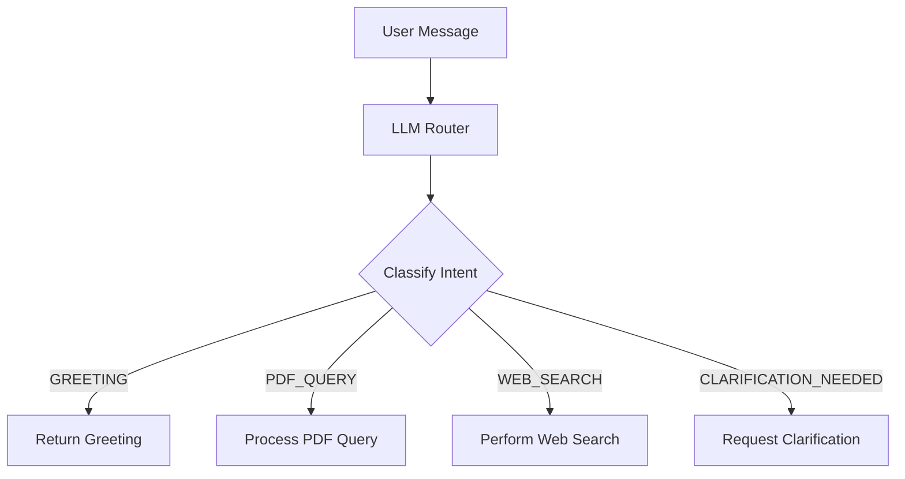

# LLM Router Documentation

## Overview

The LLM Router is a core component of the Chat with PDF application that classifies user messages into specific intents and routes them to the appropriate handler. This document combines the design, implementation, and usage details of the LLM Router.

## Table of Contents

1. [Architecture](#architecture)
2. [Intent Types](#intent-types)
3. [API Reference](#api-reference)
4. [Implementation Details](#implementation-details)
5. [Setup and Configuration](#setup-and-configuration)
6. [Usage Examples](#usage-examples)
7. [Error Handling](#error-handling)
8. [Performance Considerations](#performance-considerations)
9. [Security](#security)
10. [Testing](#testing)
11. [Future Enhancements](#future-enhancements)

## Architecture

The LLM Router follows a modular design with the following key components:

### Core Components

- **LLMRouter Class**: Main class that handles intent classification and routing
- **IntentLabel Enum**: Defines possible intent types (GREETING, PDF_QUERY, WEB_SEARCH, CLARIFICATION_NEEDED)
- **IntentPrediction Model**: Pydantic model for structured prediction output
- **LLMConfig**: Configuration for the LLM service



## Intent Types

The router classifies messages into the following intents:

- **GREETING**: Simple greetings or hellos
- **PDF_QUERY**: Questions or requests about the PDF content
- **WEB_SEARCH**: Requests for general information that may require web search
- **CLARIFICATION_NEEDED**: When the intent is unclear or more information is needed

## API Reference

### `LLMRouter` Class

#### `__init__(self, config: LLMConfig)`

Initialize the LLM Router with configuration.

**Parameters:**

- `config`: LLMConfig object containing API key and model name

#### `async route_query(self, user_message: str, force_web_search: bool = False) -> RouterResponse`

Route a user message to the appropriate handler based on its intent.

**Parameters:**

- `user_message`: The message from the user
- `force_web_search`: If True, forces WEB_SEARCH intent (default: False)

**Returns:**

- `RouterResponse` object containing:
  - `intent`: The detected intent type
  - `message`: Response message
  - `needs_clarification`: Boolean indicating if clarification is needed
  - `clarification_questions`: List of suggested clarification questions

## Implementation Details

The intent classification is performed using OpenAI's chat completion API with the following prompt:

```python
INTENT_CLASSIFICATION_PROMPT = """
You are an intent classification system. Analyze the user's message and classify it into one of these categories:
- GREETING: Simple greetings or hellos
- PDF_QUERY: Questions or requests about PDF content
- WEB_SEARCH: Requests for general information that may require web search
- CLARIFICATION_NEEDED: When the intent is unclear or more information is needed

Respond with a JSON object containing:
- "intent": One of the intent types (GREETING, PDF_QUERY, WEB_SEARCH, CLARIFICATION_NEEDED)
- "confidence": A float between 0 and 1 indicating your confidence
- "reasoning": Brief explanation of your classification
"""
```

## Setup and Configuration

1. Install dependencies:

   ```bash
   pip install openai pydantic python-dotenv
   ```

2. Set up environment variables in `.env`:

   ```env
   OPENAI_API_KEY=your_openai_api_key
   ```

3. Import and initialize the router:

   ```python
   from app.config.llm import LLMConfig
   from app.services.llm_router import LLMRouter

   config = LLMConfig(openai_api_key="your_api_key")
   router = LLMRouter(config)
   ```

## Usage Examples

### Basic Usage

```python
# Route a query
response = await router.route_query("What does this document say about AI?")
print(f"Intent: {response.intent}")
print(f"Message: {response.message}")
```

### Force Web Search

```python
# Force web search regardless of detected intent
response = await router.route_query("Latest news about AI", force_web_search=True)
```

## Error Handling

The router handles various error scenarios:

- **API Errors**: Handles OpenAI API errors and timeouts
- **Parsing Errors**: Gracefully handles malformed responses
- **Rate Limiting**: Implements basic rate limiting

## Performance Considerations

### Caching
- Implements a simple in-memory cache to avoid redundant API calls
- Cache key is the normalized (lowercase, stripped) message content
- Cache is automatically managed by the router

### Optimization
- Uses async/await for non-blocking API calls
- Implements request timeouts (default: 30 seconds)
- Includes retry logic for transient failures
- Batch processing support for multiple messages

## Security

- API keys are never logged or exposed in responses
- User messages are sanitized before processing
- Rate limiting is enforced at the API client level
- All external calls use HTTPS with certificate verification

## Testing

Run the test suite:

```bash
pytest tests/test_llm_router.py
```

## Example Usage

### Basic Request

```bash
curl -X POST http://localhost:8000/api/v1/chat \
  -H "Content-Type: application/json" \
  -d '{"message": "Hello!"}'
```

### Force Web Search

```bash
curl -X POST http://localhost:8000/api/v1/chat \
  -H "Content-Type: application/json" \
  -d '{"message": "latest AI news", "force_web_search": true}'
```

## Example Responses

### Greeting

```json
{
    "intent": "greeting",
    "message": "Hello! How can I assist you with the PDF documents today?",
    "needs_clarification": false,
    "clarification_questions": []
}
```

### Web Search

```json
{
    "intent": "web_search",
    "message": "I'll help you find that information online. Could you please clarify what you're looking for?",
    "needs_clarification": true,
    "clarification_questions": [
        "What specific information are you looking for?",
        "Are you looking for recent information or something specific?"
    ]
}
```

### PDF Query

```json
{
    "intent": "pdf_query",
    "message": "I'll search through the PDF documents for that information.",
    "needs_clarification": false,
    "clarification_questions": []
}
```

## Error Handling

The router implements comprehensive error handling for:

- API connection issues
- Invalid responses from the LLM
- JSON parsing errors
- Rate limiting and timeouts
- Missing or invalid API keys

All errors are logged with appropriate context and user-friendly error messages are returned.

## Testing

You can test the endpoint using curl:

```bash
# Basic test
curl -X POST http://localhost:8000/api/v1/chat \
  -H "Content-Type: application/json" \
  -d '{"message": "Hello!"}'

# Force web search
curl -X POST http://localhost:8000/api/v1/chat \
  -H "Content-Type: application/json" \
  -d '{"message": "latest AI news", "force_web_search": true}'
```

## Future Enhancements

1. **Enhanced Intent Recognition**
   - More sophisticated intent detection with custom training
   - Support for domain-specific intents

2. **Advanced Features**
   - Conversation history and context awareness
   - Multi-turn dialog support
   - Sentiment analysis for better response generation

3. **Performance Improvements**
   - Distributed caching with Redis
   - Request batching for high-volume scenarios
   - Adaptive timeout handling

4. **Monitoring & Analytics**
   - Prometheus metrics integration
   - Request/response logging
   - Performance dashboards

5. **Security Enhancements**
   - Rate limiting per user/IP
   - Input validation and sanitization
   - Audit logging for sensitive operations
