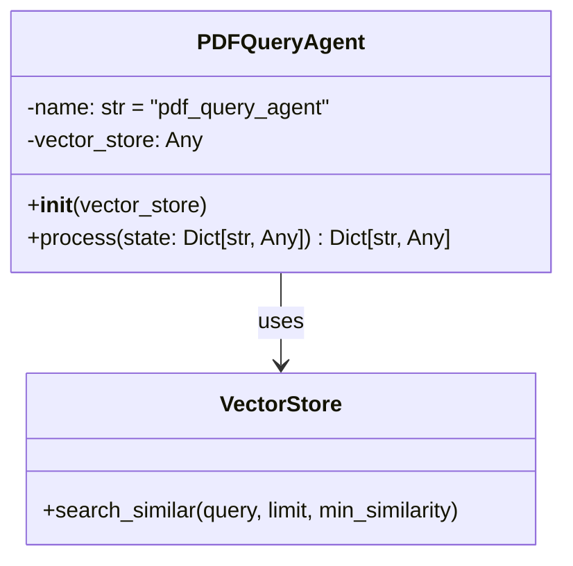

# PDF Query Agent

## Overview
The `PDFQueryAgent` is a specialized agent responsible for handling queries related to PDF documents. It performs semantic search across uploaded PDF documents using vector embeddings to find the most relevant content based on user queries.

## Architecture



## Key Components

### 1. Initialization
- **vector_store**: The vector store instance used for document search
- **name**: Set to "pdf_query_agent" for identification in logs and state tracking

### 2. Main Methods

#### `process(state: Dict[str, Any]) -> Dict[str, Any]`
The main method that processes PDF queries.

**Parameters:**
- `state`: The current conversation state containing:
  - `messages`: List of message objects with the latest user query
  - Other conversation context

**Process Flow:**
1. Extracts the latest user query from the message history
2. Performs a similarity search using the vector store
3. Updates the state with search results and current agent information

**Search Parameters:**
- `limit`: Maximum number of results to return (default: 3)
- `min_similarity`: Minimum similarity score threshold (default: 0.5)

## Integration with Vector Store

The agent relies on a vector store that implements the following interface:
- `search_similar(query, limit, min_similarity)`: Performs a similarity search and returns relevant document chunks

## State Management

The agent updates the conversation state with the following fields:
- `search_results`: List of relevant document chunks with their metadata
- `current_agent`: Set to "pdf_query_agent" to track which agent processed the query

## Error Handling
- The agent includes basic error handling through its parent `BaseAgent` class
- Invalid or missing queries will result in empty search results
- Vector store connection issues should be handled by the vector store implementation

## Usage Example

```python
# Initialize the agent with a vector store
pdf_agent = PDFQueryAgent(vector_store=my_vector_store)

# Process a query
state = {
    "messages": [
        {"role": "user", "content": "What are the key findings in the document?"}
    ]
}
updated_state = await pdf_agent.process(state)

# Access search results
results = updated_state["search_results"]
```

## Dependencies
- Requires a vector store implementation with similarity search capabilities
- Inherits from `BaseAgent` for common agent functionality

## Performance Considerations
- Search performance depends on the underlying vector store implementation
- The `min_similarity` threshold helps filter out irrelevant results
- The default limit of 3 results balances relevance and response time

## Limitations
- Only processes text content from PDFs (no images or complex layouts)
- Relies on the quality of the vector embeddings for search relevance
- No built-in support for document updates or deletions

## Related Components
- [Agent Orchestration](../docs/AGENT_ORCHESTRATION.md)
- [Vector Store Documentation](../docs/VECTOR_STORE.md)
- [Base Agent Implementation](../app/agents/base.py)
