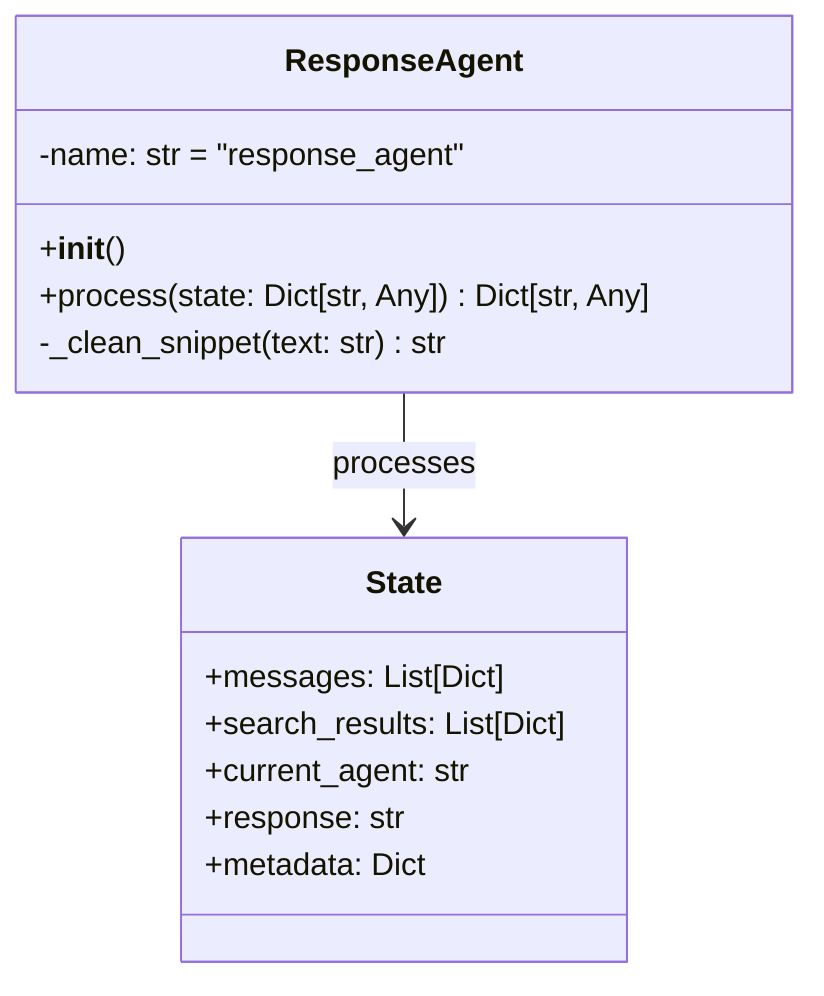

# Response Agent

## Overview
The `ResponseAgent` is responsible for formatting and presenting search results from various sources to the user. It handles different types of responses including web search results, PDF document excerpts, and error states, providing a consistent and user-friendly output format.

## Architecture



## Key Components

### 1. Initialization
- **name**: Set to "response_agent" for identification in logs and state tracking

### 2. Main Methods

#### `process(state: Dict[str, Any]) -> Dict[str, Any]`
Formats the final response based on search results and conversation context.

**State Management:**
- Processes search results from different agents (web search or PDF query)
- Maintains conversation context for follow-up questions
- Handles error states and missing results

**Response Formatting:**
- Formats web search results with title, URL, and snippet
- Formats PDF query results with source document and page numbers
- Adds contextual prefixes for follow-up questions
- Handles empty result sets with helpful messages

#### `_clean_snippet(text: str) -> str`
Helper method to clean and format text snippets.
- Removes extra whitespace and newlines
- Ensures consistent formatting
- Handles empty or None inputs

## Response Formats

### Web Search Results
```
1. [Title]
   URL: [URL]
   Snippet: [Truncated text...]
```

### PDF Document Results
```
1. From [Document Name] (Page X):
   [Relevant text excerpt...]
```

### Error/No Results
- Provides clear feedback when no results are found
- Suggests next steps or asks for clarification
- Maintains helpful tone in all responses

## Integration Points
- Works with `WebSearchAgent` and `PDFQueryAgent` results
- Processes state from the `AgentOrchestrator`
- Maintains compatibility with the conversation state structure

## Error Handling
- Gracefully handles missing or malformed data
- Provides user-friendly error messages
- Includes fallback content when needed

## Usage Example

```python
# Initialize the agent
response_agent = ResponseAgent()

# Process search results
state = {
    "search_results": [
        {
            "title": "Example Document",
            "snippet": "This is an example search result...",
            "link": "https://example.com"
        }
    ],
    "current_agent": "web_search_agent",
    "metadata": {
        "intent_classification": {
            "is_follow_up": False
        }
    }
}

updated_state = await response_agent.process(state)
print(updated_state["response"])
```

## Related Components
- [Agent Orchestration](AGENT_ORCHESTRATION.md)
- [Web Search Agent](WEB_SEARCH_AGENT.md)
- [PDF Query Agent](PDF_QUERY_AGENT.md)
- [Base Agent Implementation](../app/agents/base.py)
