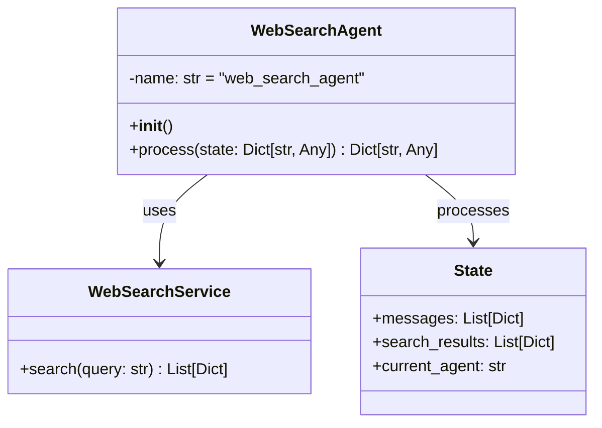

# Web Search Agent

## Overview
The `WebSearchAgent` is responsible for handling web search queries by interfacing with external search services. It processes user queries, performs web searches, and formats the results for further processing by the `ResponseAgent`.

## Architecture



## Key Components

### 1. Initialization
- **name**: Set to "web_search_agent" for identification in logs and state tracking
- Initializes the base agent with the name "web_search_agent"

### 2. Main Methods

#### `process(state: Dict[str, Any]) -> Dict[str, Any]`
Processes web search queries and updates the conversation state with results.

**Parameters:**
- `state`: Current conversation state containing:
  - `messages`: List of message objects with the latest user query
  - Other conversation context

**Process Flow:**
1. Extracts the latest user query from the message history
2. Calls the web search service with the query
3. Updates the state with search results and current agent information

**State Updates:**
- `search_results`: List of search results from the web search service
- `current_agent`: Set to "web_search_agent" to track which agent processed the query

## Integration Points

### Web Search Service
- Interfaces with the `web_search_service` for performing actual web searches
- Expects the service to implement an async `search(query: str)` method
- Processes results in a standardized format for the response agent

### Expected Search Result Format
```python
[
    {
        "title": "Result Title",
        "snippet": "Brief description or excerpt...",
        "link": "https://example.com"
    },
    # ... more results
]
```

## Error Handling
- Basic error handling is inherited from the `BaseAgent` class
- Relies on the web search service for handling search-related errors
- Returns empty results if no query is found in the state

## Usage Example

```python
# Initialize the agent with a web search service
web_agent = WebSearchAgent()

# Process a search query
state = {
    "messages": [
        {"role": "user", "content": "What are the latest AI developments?"}
    ]
}
updated_state = await web_agent.process(state)

# Access search results
results = updated_state["search_results"]
```

## Performance Considerations
- Search performance depends on the underlying web search service
- Response times will vary based on network conditions and service availability
- The agent is designed to be non-blocking with async operations

## Limitations
- Requires an active internet connection
- Search quality depends on the underlying web search service
- No built-in caching of search results

## Related Components
- [Response Agent](RESPONSE_AGENT.md)
- [Agent Orchestration](AGENT_ORCHESTRATION.md)
- [Base Agent Implementation](../app/agents/base.py)
